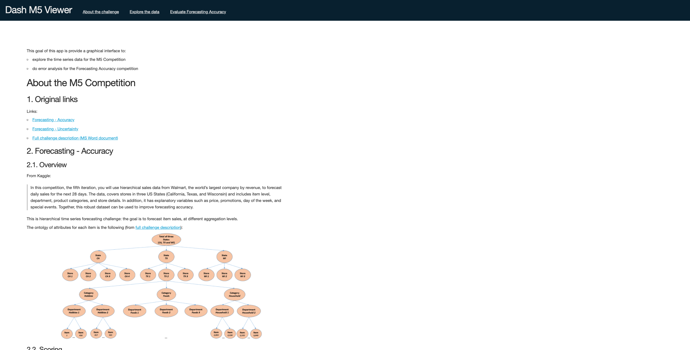
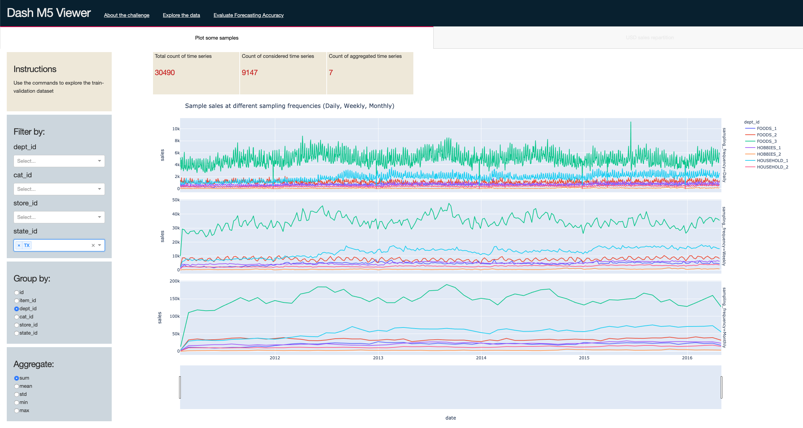
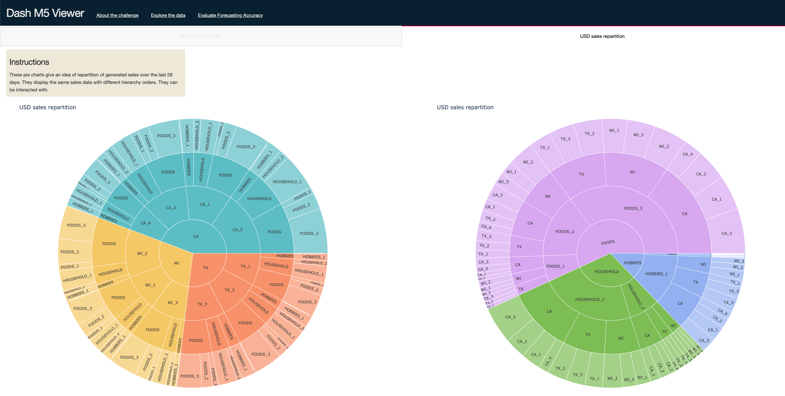
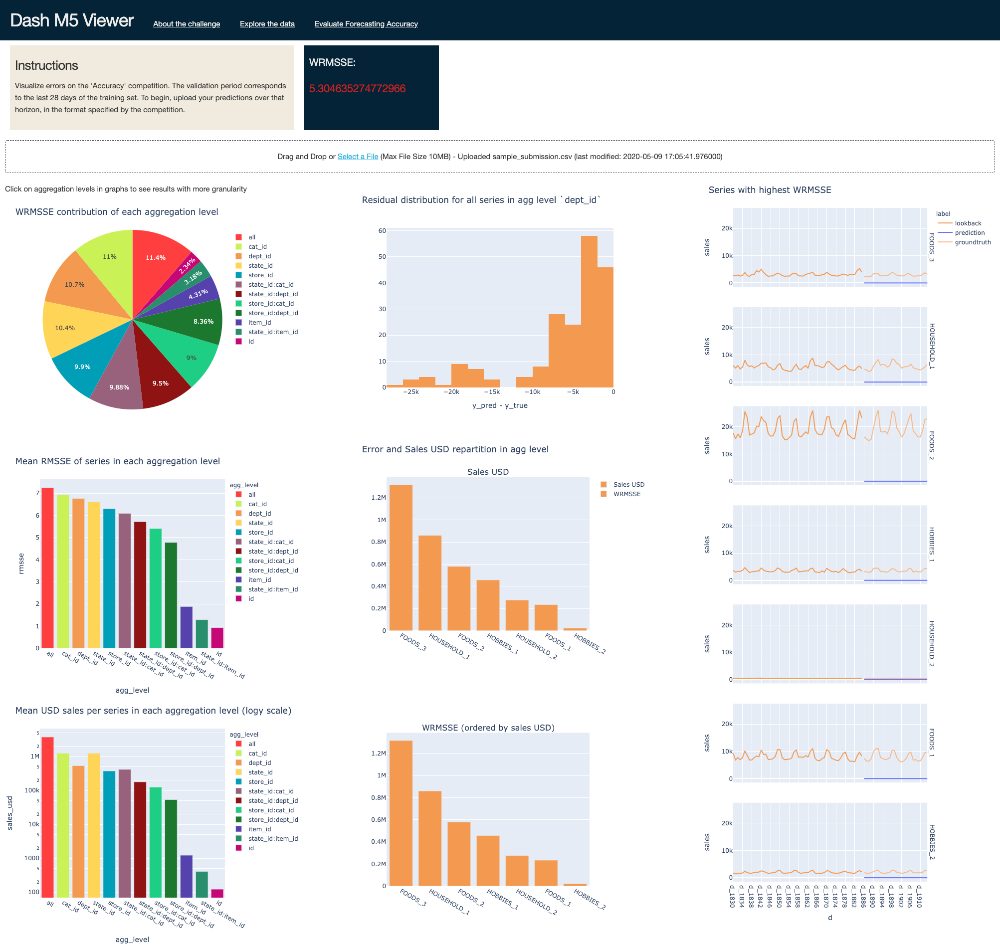

# M5 Viewer

## Purpose

This goal of this app is provide a graphical interface to:

- explore the time series data for the [M5 Competition](https://www.kaggle.com/c/m5-forecasting-accuracy)
- do error analysis for the Forecasting Accuracy competition

This app is based on Plotly's [Dash](https://plotly.com/dash/) Python framework.

## Run locally

### Set the virtual environment

This project uses `pipenv` for python dependency management.

To install dependencies for this project, run:

```
$ git clone https://github.com/syltruong/m5-viewer.git
$ cd m5-viewer
$ pipenv install
```

### Get the data

#### Option 1: Use the `kaggle` CLI

Run

```
$ cd m5-viewer
$ pipenv run kaggle competitions download -c m5-forecasting-accuracy
$ unzip m5-forecasting-accuracy.zip -d data 
$ rm m5-forecasting-accuracy.zip
```

#### Manually download the data files

and unzip them in the `data/` directory


### Run the app

Run

```
$ pipenv run python index.py
```

Note that the first run will precompute some data objects, which are stored in `data/.cache`.

Subsequent service start will check for presence of these data objects and load them if present, leading to faster starting time.

## Visuals

The app is currently made of three tabs:

### 1. About the challenge

In this tab, we remind the purpose of the challenge and the evaluation metric.



### 2. Explore the data

There are two interactive visualizations in this tab.

The first one is about plotting time series samples. The user can chose to filter and group according to various metadata fields.



The second is about looking at sales repartition: because the metric is dependent on sales importance, one may be interesting in having these proportions in mind.


### 3. Evaluate Forecast Accuracy

This tab lets the user upload a prediction csv file and validate it against the last 28 days of the train dataset. Different error analysis visualizations are suggested.



